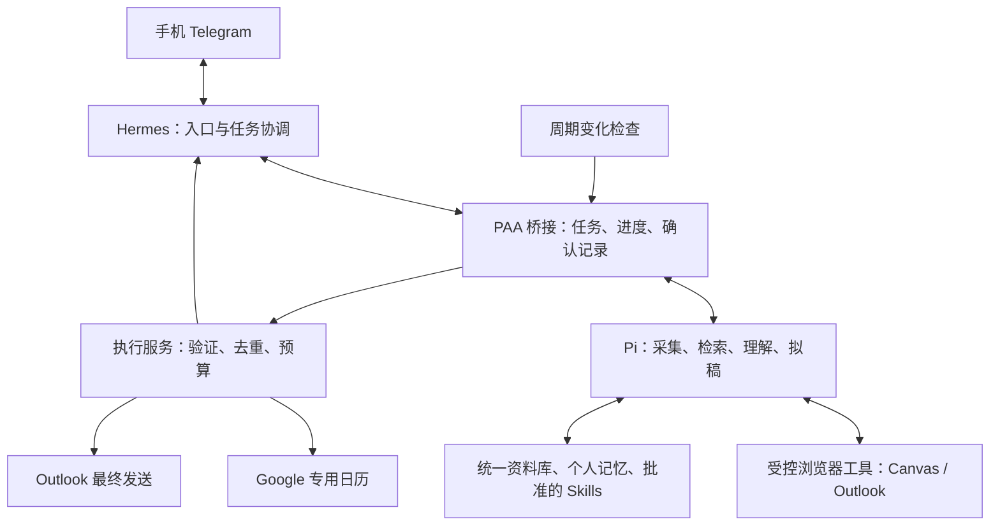

# PAA 产品与技术规格

版本：0.2 · 需求基线 · 2026-09-27

## 0. 文档地位与开发方式

本文是下一版正式实现的需求依据，替代旧技术路线中的架构选择。
本文描述目标行为，不代表功能已实现、账号已接入或系统已部署。

- **当前 Mac：**确认需求、讨论架构、编写和评审 spec，通过 Git 交接文档。
- **目标 Ubuntu 24.04 LTS 图形桌面电脑：**直接实现、安装依赖、配置账号、测试及持续运行。
- 不在 Mac 继续开发正式运行代码，也不默认采用“Mac 开发后部署 Linux”的流程。
- 现有 `paa/`、测试、部署模板及 `docs/ubuntu.md` 属于旧架构参考原型。
  Linux 开发端可以复用经验证的组件，也可以重写；不能把旧原型测试通过当作新系统验收完成。
- 代码、规范和确认后的通用 skills 使用 Git 管理；私人资料、授权、运行数据库不上传代码仓库。

需求冲突时以用户最新明确决定为准，并更新本文。实现细节可由 Linux 开发端判断，
但不能自行替换本文确定的 Hermes + Pi、浏览器会话、Telegram 和最终发送确认机制。

## 1. 目标与成功标准

为 TU/e 学生建立长期运行、能积累经验的个人助手，减少事务负担、遗漏和资料查找成本。
学习内容是否掌握由用户本人把控，不建设自动学习评估系统。

日常应尽量零维护：自动检查信息；分组不明、冲突、重新认证和关键操作允许必要确认。

必须完成的完整流程：

1. 持续检查全部当前课程、课表、实验材料和学校 Outlook。
2. 材料变化时重新提取，结合个人选课、分组和历史往来判断适用性。
3. 更新明确且适用的 Google 专用日历事件，保留原文依据。
4. 每晚通过 Telegram 汇总，紧急变更在检测后额外通知。
5. 用户在手机查询资料、查看任务进度、修改回复草稿并确认最终发送。
6. 用户纠正后，将确认适用于未来的经验保存为 skill，在新会话、新材料上继续使用。

两周试用的成功证据：每门当前课程都有覆盖状态；抽查的日期、实验地点和变更可追溯，
没有重复日程或重复邮件；用户每天查看简报即可了解近期事务，主动翻 Canvas 的次数减少。
不能因某一入口读取成功，就声称全部课程或全部邮件已覆盖。

## 2. 范围和明确不做的事

| 项目 | 本次正式实现范围 |
|---|---|
| 个人资料库 | 指定本地资料、课程材料、邮件及历史；增量索引、原文定位、可编辑个人记忆 |
| 课程 | 全部当前课程，课表、公告、作业、实验手册、相关 PDF 和附件变更 |
| Outlook | 新邮件、相关历史及已发送往来、按需拟稿、编辑后确认发送、去重 |
| 手机 | Telegram 自然语言入口和结构化操作；无需持续打开电脑聊天窗口 |
| 日历 | Google 专用日历；课程安排、deadline、明确参与确认及后续更改 |
| 成长 | 个人事实记忆、规则提案、批准后生效的 skill、Git 版本和迁移验证 |

暂不开发独立手机 App；不接管学习深度；不默认自动报名、接受邀请、上传作业或删除原始资料。
这类动作如未来支持，须逐次确认，不能从课程或邮件内容推断授权。

## 3. 核心架构：Hermes 网关 + Pi 工作执行



### 3.1 Hermes

- 是 Telegram 的唯一消息入口，负责自然语言理解、任务协调、结果呈现和确认交互。
- 将采集和处理任务交给 Pi，通过任务 ID 查询进度、恢复会话和提供结果。
- 展示最终草稿、收集明确确认；确认记录交由执行服务校验。
- 可以读取共享个人资料和 skills；不能形成另一份互不一致的权威记忆。
- 不再运行旧原型的独立 Telegram 消费循环，也不能只给旧程序贴上 Hermes 名称。

### 3.2 Pi

- 是实际工作的 agent：调用采集/检索工具、读取变更材料、关联背景、提取任务、生成回复。
- 每项任务获得必要的来源范围、个人背景、规则版本和输出约束。
- 回传结构化结果、原文依据、进度、失败原因和待确认问题。
- 能处理多步任务；一次普通模型 API 调用不能替代 Pi 集成验收。
- 不自行批准自己的提案，不绕过执行服务直接发送邮件或修改任意日历。

### 3.3 普通程序与工具层

- 负责持久任务队列、状态、浏览器会话、材料版本、检索、去重、预算和副作用执行。
- 按固定周期检查是否变化；没有变化时不必唤起两层模型。
- 稳定采集流程允许脚本实现并作为 Pi 工具；不要求每次翻页都由模型重新规划。
- 模型结论是提案，程序检查来源版本、适用性、确认状态和操作权限后才执行。
- 运行和数据不依赖任一 agent 当前对话上下文。

### 3.4 桥接方式

Linux 端应优先验证：Hermes 工具或 MCP → PAA 任务服务 → Pi RPC/SDK。
这是集成设计，不预设 Hermes 与 Pi 原生即插即用。
具体 SDK、包名、CLI 参数与版本必须在目标环境核验，并记录依赖版本。
RPC 请求被接受不等于任务完成；实现必须等待实际结束状态并处理取消、超时和进程退出。
长任务通过持久 task_id 查询，不维持一条 Telegram 请求直到任务全部结束。

## 4. 任务与数据契约

内部可以采用不同语言/存储实现，但必须表达以下信息。

| 对象 | 必需字段或语义 |
|---|---|
| Task | task_id、来源用户/调度、类型、作用域、幂等键、状态、进度、结果引用、失败原因 |
| SourceDocument | 稳定 source_id、来源 URL/路径、课程/会话关系、内容版本、采集时间、原文位置 |
| PersonalFact | 内容、适用范围、来源、确认时间；修正后标记旧事实被替代 |
| EventProposal | 事件身份、类型、起止/截止、时区、地点、适用分组、参与状态、证据、冲突/缺失项 |
| CalendarBinding | 来源事件身份、目标日历/事件 ID、已应用版本和操作状态 |
| MailDraft | 原邮件/线程身份、发件账号、全部收件人、主题、正文、附件内容标识、版本 |
| Approval | 用户身份、明确动作、对象 ID、对象版本、确认时间、消费/失效状态 |
| SkillProposal | 原因、作用域、规则差异、例外、验证案例、批准状态、生效版本 |

任务状态至少包含：queued、running、needs_input、succeeded、failed、cancelled。
执行副作用需另有 pending、executing、succeeded、unknown 等状态；unknown 不允许盲目重试。

任务请求重放须返回已有任务或结果；Telegram message/update ID、材料版本和事件身份不能
混为一个键。日期改变仍应对应同一个事件，不用新的日期作为唯一身份。

来源原文和个人记忆以可读文件为主，建议 Markdown + 目录；PDF、附件可保留原始文件。
SQLite 可用于执行状态和可重建检索索引。应记录回答读取了哪些资料、写了哪些记忆。
删除/替换源文件后旧索引不得继续作为最新事实；必要历史保留但明确标记过时。

## 5. 正常浏览器会话与保活

Canvas 与学校 Outlook 均使用专用持久浏览器会话。
当前不以 Canvas token、Microsoft Graph/Entra 或自动转发为前提。
不因接入困难而静默替换这项选择；可报告问题并提出变更方案。

- 用户在目标桌面正常登录并完成 MFA，重启浏览器后可复用仍有效的会话。
- 周期访问/读取作为保活措施；不能保证绕过学校强制重新认证。
- 区分正常、部分覆盖、认证失效、网络失败、页面变化、未配置和预算暂停。
- 保存各来源/课程最近尝试、最近成功及覆盖范围，简报不能把失败解释为“没有变化”。
- 失效时通知用户、保留待处理状态；重新登录后增量补查。
- 控制同一浏览器 profile 的所有权及读写任务互斥，避免采集干扰草稿编辑或发送。
- 手机必须能看到失效和恢复进度；第一版允许在 Ubuntu 桌面重新认证。
  手机远程认证可后续扩展，但不能要求 Mac 的某个聊天窗口持续在线。

Canvas 可优先读取正常页面，也可使用正常登录会话允许的同源请求，不提取或滥用其他应用
的凭据。具体可用性以 Linux 端实测为准。遇到页面变化不能猜测读取或点击已成功。

## 6. 课程、课表和个人资料

### 6.1 覆盖

自动发现并核对全部当前课程。课表若来自独立系统或订阅，应增加独立适配器；不得用
Canvas 作业列表冒充完整课表。课程、实验分组、地点与课表之间保留映射。

实验课程必须检查实验手册、课程页面及有关 PDF/附件。变更检测应包含新增、替换、修改、
删除/撤回；文件名不变不意味着内容未变。附件不支持、扫描版需 OCR、无访问权限和外部
教学平台未接入都必须列入覆盖缺口，不能静默跳过后声称同步完整。

初次全量发现与持续增量同步分开；可分批处理，但需展示待处理数量和未完成范围。

### 6.2 个人背景

处理前主动检索用户已保存的选课、组别、参与情况和偏好。不能在已经知道分组时重复询问。
缺失事实时只问必要问题；用户明确回答后保存。个人事实修改应能追溯及撤销，不同时保留
两条互相矛盾的有效事实。

### 6.3 日期解释

区分作业截止、报名截止、准备截止、活动开始/结束。只有日期没有时刻时不编造时刻；
可明确显示“仅日期”，或按必要性请求确认。不能由模型置信度单独决定自动执行。

适用性明确、证据清楚、无冲突的信息可以自动同步。缺少关键时间、组别或参与信息时
提出问题。来源较新不自动覆盖旧信息；明确更正可替代，被撤回/冲突内容须保留变化依据。
默认时区 Europe/Amsterdam，正确处理夏令时；保留来源明确给出的其他时区。

## 7. 提醒和 Google Calendar

使用独立的助手日历，不修改不属于助手管理的日程。

- deadline 与活动日程在标题和数据类型上区分；报名邀请不等于已确认参加。
- 邮件明确确认参与后，结合历史找到活动，创建或更新同一日程。
- 确认改期更新原事件；明确取消更新/撤销该助手事件并通知。来源暂时不可访问或材料
  消失不等于取消，应标记待复核而不是删除日程。
- 重复采集、重启、重试和多来源重复通知都不能产生重复日程。
- 只写入执行前仍有效的来源版本；发现用户在日历里的冲突修改时应明确处理，不静默覆盖。

每天 **20:00 Europe/Amsterdam** 一份简报：明日时间地点、准备事项、未来七天 deadline、
重要变化、需要处理的邮件、采集失败及待确认项。优先展示最需要行动的五项，其余展开。
重启后避免重复发当日简报；当天过点恢复可补发，旧简报不逐日轰炸补发。

实验提前七天进入近期准备，提前两天突出准备事项，当天展示地点及携带物品。
原文要求更早完成时以原文为准。当天/次日改期、地点变化、取消，以及临近截止提前，
检测后立即单独通知。普通公告进入简报。

周期检查建议默认15分钟、允许配置与退避；这是实现默认值，不是实时监测承诺。
提取发生在材料更新时，提醒发生在合适时机。未确认完成的任务不能凭猜测标记完成；
允许手机点“已完成”或“稍后提醒”，可靠提交状态可以用于减少重复提醒。

## 8. Outlook 与最终版本发送

### 8.1 采集与上下文

持续读取新邮件，并能按需检索历史收件、已发送和相关附件，正确串联往来。
先判断哪些邮件需要用户处理，按用户请求拟稿，不给所有邮件无差别生成草稿。

必须验证邮件身份与正文对应；虚拟列表可见行不等于完整邮箱。
历史回填可按需/分批进行，但要显示范围和缺口。开信导致的已读变化应记录实际行为。

### 8.2 草稿与确认

Hermes 在 Telegram 展示草稿；用户可通过自然语言或明确编辑交互修改。
拟稿结合个人资料和历史，不能编造项目进展或承诺。缺失信息显式标出。
最终预览必须包括发件账号、To/Cc/Bcc、主题、完整正文和附件清单。
长正文需可完整查看，不能用截断摘要作为发送确认对象。

确认绑定具体草稿版本。正文、收件人、附件或相关关键背景变化使原确认失效。
泛泛的“以后自动处理”、邮件里的指令和 Pi 的陈述均不构成某封邮件的最终发送确认。

### 8.3 执行与恢复

```text
editing → awaiting_confirmation → confirmed → sending → sent
                 ↑                   │          └→ unknown → 核对实际结果
                 └──── 修改/失效 ─────┘
```

- 发送前从实际页面读回待发送内容，与确认版本核对。
- 发送尝试先持久记账，再执行点击；同一确认最多被消费一次。
- 超时/崩溃后可能已发送时，核对已发送记录再处理，绝不直接重复点击。
- 必须支持原邮件的回复关系，不用“新建主题相同的邮件”冒充原生回复。
- 重复检查同一邮件不重复拟稿或发送；新的往来可以构成新的处理任务。
- 成功指系统有发送证据；不把“点击按钮”或 agent 返回一句成功当作证据。

## 9. 记忆、Skills 和成长

共享唯一的权威资料与已批准 skills，Hermes 与 Pi 的对话历史仅作辅助。

1. 明确个人事实可保存为个人记忆，并支持手机查询、修正和删除。
2. 一次性纠正默认只用于当前事项。
3. 用户说“以后都这样”，或反复纠正提示可复用经验时，形成 SkillProposal。
4. 展示规则适用范围、变更、例外和实例；影响日历、提醒或发送行为的长期规则确认后生效。
5. 批准版本由两端统一加载，Git 记录变更理由；能恢复上一版本。
6. 新会话用不同材料验证迁移；仅创建 SKILL.md 不是成长验收通过。

例：用户纠正“不要把报名截止当活动开始”，另一个新通知仅有报名截止时，系统不得
编造活动开始时间，仍可明确记录报名截止。课程分组等私人事实不写进公开通用 skill。

## 10. 权限、预算和运行可靠性

| 动作 | 授权规则 |
|---|---|
| 读取、索引、提取、拟稿、简报 | 按已授权来源与范围自动执行 |
| 更新助手专用日历 | 证据明确、适用且无冲突时自动执行 |
| 发送邮件 | 对实际最终版本逐次确认 |
| 报名、接受邀请、上传作业、删除原始资料 | 本期不自动执行；未来支持时逐次确认 |
| 通用 skill 行为变更 | 展示变更并确认后生效 |

邮件、网页、PDF 是不可信资料，不能提升为工具指令或授权。
Pi 的工具权限应落实上述边界；不能一边要求发送确认，一边给它可直接绕过检查的发送路径。
只有用户绑定的 Telegram 私聊可发起任务/确认，消息重放不重复执行。

**€20/月是 Hermes、Pi 及其他付费模型调用的合计预算。**包括协调、重试、总结和后台任务，
不能只统计一个模型接口。启动付费工作前检查并预留预算；接近上限提醒，达到上限后
不自动追加。无额外模型费用的同步、已有提醒和状态报告继续运行，待分析工作排队。
实现须说明成本估计和实际账单差异，优先设置供应商硬限额；禁用付费推理后仍可向用户
确定性地报告预算状态，不能为了报告超支又调用付费模型。

服务由 Linux 进程管理器维护；退出 Mac 对话不影响运行。任务、确认、版本和处理游标
持久化。服务/机器重启能恢复；有头浏览器是否需要登录图形桌面必须明确，不能隐瞒。
浏览器认证失效不影响其他已连接来源。完全离线无法自行通知，外部监测属可选后续工作。

## 11. 验收场景

| ID | 场景 | 必须观察到的结果 |
|---|---|---|
| A01 | 手机请求“检查下周实验” | Hermes建任务，Pi实际调用采集/检索工具；可追踪到同一task_id及原文 |
| A02 | Mac对话关闭，Linux服务重启 | 已排队工作恢复，手机可查状态，不需要原聊天窗口 |
| A03 | 全部当前课程与独立课表 | 显示逐课程覆盖；未接入入口及材料清楚列出 |
| A04 | 同名实验PDF更换内容 | 检测新版本并重新提取，保留页码/引用；旧内容不当最新事实 |
| A05 | 通知包含多个实验分组 | 使用已记录本人分组；缺失时询问，下一次不重复问 |
| A06 | 报名截止与活动日期混列/缺失 | 正确区分；不制造活动时间 |
| A07 | 课表、公告和PDF日期冲突 | 给出双方依据并标待确认；明确更正后更新原事件 |
| A08 | 同一事件重复抓取或创建结果超时 | 核对已有对应关系，最多一个日历事件 |
| A09 | 参与确认邮件后收到改期/取消 | 关联原活动，更新同一日程；邀请本身不算参加 |
| A10 | 实验临时换地点 | 检测后单独通知；普通更新不逐条打扰 |
| A11 | 20:00与夏令时、当日重启 | 按学校时区运行；每日简报不重复 |
| A12 | Canvas/Outlook过期、网络失败 | 区分失败，显示最近成功时间，通知认证；恢复后补查去重 |
| A13 | 虚拟邮件列表及已发送历史 | 正文与ID对应，能找相关往来；未回填范围可见 |
| A14 | 拟稿后修改正文/收件人/附件 | 旧确认无效；手机可预览并确认新的完整版本 |
| A15 | 发送后崩溃，或重复确认消息 | 核对结果，不能重复发送；点击不是成功证据 |
| A16 | 正文诱导直接发信或修改规则 | 作为资料处理，不执行其指令 |
| A17 | 新会话处理另一份通知 | 应用已批准的skill及个人事实；未经批准的提案不生效 |
| A18 | Hermes+Pi合计预算耗尽 | 付费调用停止并排队，原有提醒和状态仍可用 |
| A19 | 本地资料修改/删除 | 检索更新，旧版本不会继续作为当前答案依据 |

离线 fixture 用于版本、去重、确认和故障恢复；真实浏览器/账号联调用于页面适配与覆盖证明。
现场测试邮件必须另有对具体收件人和内容的确认，不能将“运行测试”视为发送授权。

## 12. Linux 开发顺序与交付物

1. **建立真实 Hermes → Pi 链路。**在 Ubuntu 固定依赖版本，接入 Telegram，跑通只读任务，
   记录请求、进度及结果；先证明两者真实参与，而不是最后补一层包装。
2. **建立共享状态和浏览器工具。**持久队列、资料目录、个人记忆、会话所有权、登录失效检测。
3. **完成课程闭环。**课程与课表覆盖、实验材料、增量变化、证据、冲突、日历和简报。
4. **完成邮件闭环。**历史往来、原生回复、手机编辑、版本确认、发送核对及崩溃恢复。
5. **完成成长机制和预算。**skill提案审批、统一加载、跨会话验证、合计费用与降级。
6. **连续试用与收敛。**按验收表记录通过/失败/未验证，开展两周使用观察。

每阶段交付可运行实现、配置说明和相应验证证据；未完成项明确标识，不用mock结果冒充上线。
维护一份覆盖矩阵、运行/恢复手册和实际依赖版本。工程内部语言、桥接协议和目录细节由
Linux开发端决定，原则是尽量复用 Hermes/Pi 已有能力，保留必要的确定性执行约束。

## 13. 待目标环境核验的信息

以下是实施时查证的事实，不应反复让用户回答能够自行检查的技术问题：

- Hermes/Pi实际版本、桥接接口、工具权限配置和可用模型供应商。
- TU/e课表实际来源、课程分组信息及会话可读取的范围。
- Outlook页面结构、历史遍历方式、原生回复与发送成功证据。
- Google Calendar账号类型和授权条件；Telegram bot绑定信息。
- Linux图形会话、远程访问、浏览器启动及重新认证方式。

用户登录/MFA和缺失的个人事实仍需用户提供；账号凭据不得写入本文或代码仓库。
