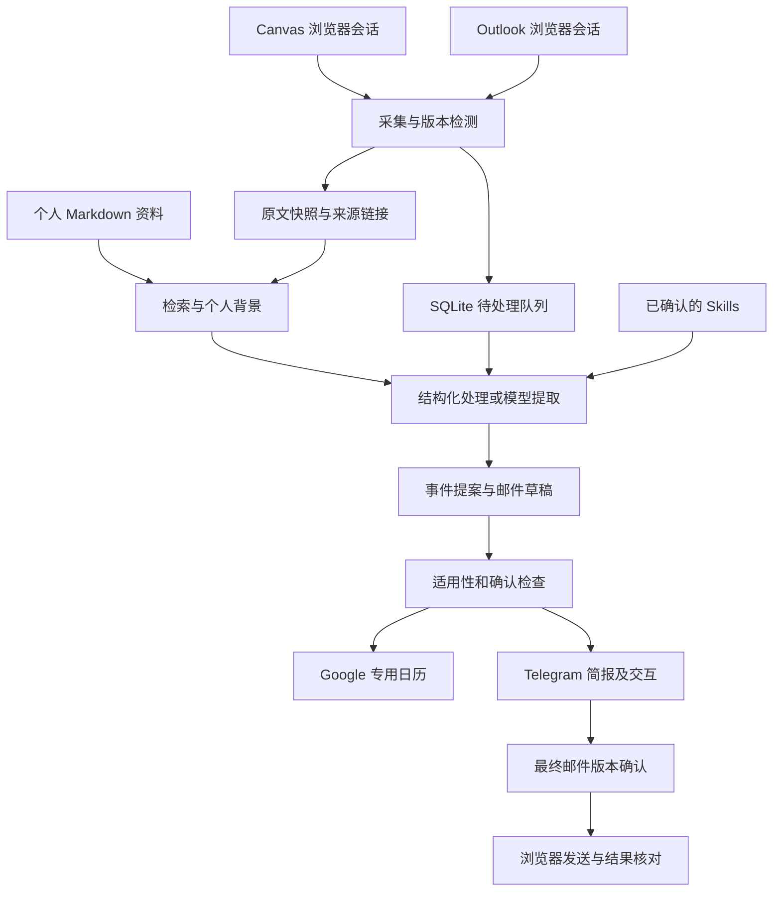

# PAA 技术路线与实施阶段（旧原型记录）

> 已由 [Spec v0.2](spec.md) 替代。本文保留历史取舍；其中“自有 Python 循环、
> 后续再接入 Hermes”的路线不再是正式实现方案。正式开发直接在目标 Ubuntu 进行。

本文记录已经确认的产品需求、技术选择及后续实施顺序。目标环境为 Ubuntu 24.04 LTS
图形桌面，服务独立运行，不依赖 Mac 或某个持续打开的对话窗口。

状态基线：v0.1 开发版，已有离线测试，尚未经真实学校账号联调。
“已实现”表示代码存在，不表示账号连接或生产运行已验证。
部署命令见 [Ubuntu 部署指南](ubuntu.md)，能力摘要见 [项目首页](../README.md)。

## 1. 用户目标与范围

优先减少事务负担、遗漏和找资料的时间；学习深度由本人掌控。
覆盖全部当前课程，关联课表、作业、公告、实验手册和相关附件。
日常使用尽量零维护，但分组不明、来源冲突、重新认证和发送邮件允许必要确认。

完整实验范围包括：

1. 可增量更新、能追溯原文的个人资料库。
2. 持续获取 Outlook 邮件、关联历史往来、按需拟稿，发送用户确认的最终版本。
3. Telegram 手机入口：发起任务、查看进度、查资料、编辑及确认草稿。
4. 从明确的参与确认邮件及课程安排同步 Google Calendar。
5. 共享个人背景与执行状态，完成跨工具流程。
6. 将确认过的长期经验沉淀为可修改 skill，以 Git 管理代码与通用规则。

第一条需要反复使用的流程：

> 检查课程变化 → 提取行动信息 → 检索个人分组等背景 → 更新已确认日程 →
> 每晚简报或紧急通知 → 手机查看原文、确认疑问 → 保存确认后的经验。

## 2. 已确定的技术选择

| 层次 | 当前路线 | 原因与边界 |
|---|---|---|
| 运行环境 | 独立 Ubuntu 24.04 桌面，systemd 用户服务 | 当前有头浏览器依赖图形登录会话；不是开机未登录即可运行 |
| Canvas | Playwright 持久浏览器会话 | 学校限制用户自行创建 token；不依赖个人 token |
| Outlook | 正常浏览器会话与 UI 适配器 | 用户选择暂不使用 Entra/Graph，也暂不配置邮件转发 |
| 手机 | Telegram bot 私聊 | 先复用现成入口，独立网页/App 留待后续 |
| 资料 | Markdown 原文快照、指定个人资料目录 | 可读、可检查、可编辑、可定位来源 |
| 执行状态 | SQLite | 持久保存版本、队列、确认状态、预算与事件对应关系 |
| 日历 | Google Calendar 官方接口、专用日历 | 独立于学校邮箱认证；确定事件 ID 用于重试去重 |
| 智能提取 | 可选兼容 chat-completions 的模型接口 | 只生成结构化提案/草稿，无任意工具执行权限 |
| Agent | 当前运行自有 Python 循环；后续优先评估 Hermes | Hermes、OpenClaw、Pi 尚未安装或集成，不是当前运行依赖 |

Canvas 的具体实现是在已登录页面内发起同源请求读取课程 JSON，并通过浏览器上下文
下载文件。这仍需学校允许会话访问相应接口；不能把“不需要 token”理解为必然可访问。
若被拒绝，要报告失败并实现适合实际页面的 DOM 适配器，目前该替代适配器尚未实现。

## 3. 数据与执行流



运行时私人数据位于 `.runtime/`，包括浏览器 profile、原文快照、个人记忆、数据库和
Google 授权缓存。模型及 Telegram 密钥通过私有环境配置传入。
Git 只保存实现、示例配置、部署说明和通用规则，不保存上述私人内容。

## 4. 采集、保活与认证恢复

- 复用 PAA 专用持久浏览器 profile，用户手动完成登录和 MFA。
- 周期读取兼作会话活动；保活不保证突破学校规定的认证时限。
- 登录失效、网络故障、缺失选择器和不完整覆盖分别报告，不能解释为“无新内容”。
- 认证失效时通知 Telegram；恢复后按版本记录补查，避免重处理。
- 当前重新认证需在 Ubuntu 桌面完成；手机远程认证界面尚未开发。
- 电脑离线时不能自行发告警；即时离线告警需未来增加外部监测。
- 当前默认检查间隔 15 分钟；“紧急推送”指检测到以后尽快通知，不是实时订阅保证。

Outlook UI 必须核对当前消息身份与阅读区内容，避免将上一封正文保存到下一封名下。
当前只扫描已渲染消息行；后续补齐虚拟滚动、其他文件夹、历史往来和附件覆盖。
读取网页可能使邮件变为已读，应在账号联调时确认实际影响。

## 5. 日期、提醒和日历规则

目标行为：

- 材料变化时提取，通知时间单独安排。
- 区分报名截止、作业截止、准备截止与活动起止，不相互替代。
- 优先使用明确的本人选课/分组；不确定时询问并保存个人事实。
- 明确的更正通知可更新原日程；文件更新时间本身不证明某日期优先。
- 来源冲突保留双方依据；不猜测缺失的年份、时间、地点和活动时长。
- 学校当地时区使用 Europe/Amsterdam，处理夏令时。
- 每晚 20:00 发送次日简报，包含未来七天 deadline 和准备事项。
- 实验提前七天进入近期准备、提前两天突出提示，当天显示地点和携带物品；
  原文有更早要求时优先采用原文。
- 当天/次日改期、换地点、取消以及临近 deadline 提前，检测后单独通知。

v0.1 实际范围：明确 Canvas due_at 自动建立事件；正文/PDF 日期全部进入待确认提案。
已确认的两日内新增/变化事件会通知。完整取消通知语义、实验分层准备计划尚未实现。
使用固定事件 ID 和来源版本，避免同一事件反复创建。
来源变化会使原事件失去有效批准；旧日历事件暂时保留供复核，不自动删除。

## 6. 邮件拟稿与发送

目标流程是先识别待处理邮件，由用户发起拟稿；检索个人资料及历史往来后生成回复。
没有依据的进展标为待补充，不编造完成情况。

发送确认绑定：全部收件人、主题、正文、附件与草稿版本。编辑后旧确认失效。
程序点击发送前持久记录执行状态，不能仅靠 skill 提醒模型遵守。

```text
review → confirmed → sending → sent
   ↑         │           └→ unknown（先核对，禁止盲目重试）
   └─内容编辑或发送前检查失败
```

当前 Telegram 支持生成/编辑/展示/确认草稿；发送适配器默认关闭。
实际页面校准后只支持无附件的新邮件，不支持原生 Reply 线程。
完整历史检索、原生回复与附件处理是下一阶段工作，当前不能宣称完整邮件闭环已上线。

## 7. 记忆、Skill 与成长

- 个人事实：身份、课程分组、明确偏好等，保存到私人 Markdown；处理任务时主动检索。
- 通用规则：例如不把报名截止当成活动开始，保存到项目 skill。
- 一次纠正默认只影响当前事项；明确要求“以后如此”或重复纠正时提出长期规则。
- 展示规则的适用条件、例外和示例，用户确认后更新 skill 并以 Git 记录。
- 用另一份通知验证规则能否迁移，不能把“写进文件”视为已经学会。

当前已保存 [课程处理 skill](../skills/course-assistant/SKILL.md)，支持个人事实记录。
自动生成 skill、Telegram 内规则提案审批与版本回滚界面尚未实现。

## 8. 费用与权限

模型试验预算 €20/月。只有资料变化或用户发起拟稿时才调用模型。
调用前预留保守费用，达到配置上限后排队；普通同步、已有提醒与状态报告继续运行。
本地账本依赖配置价格和模型输出限制，供应商额外计费不在其控制内；实际账单硬上限
还需供应商端配置。初次全量课程分析可能分批跨越多次运行。

自动允许：读取、索引、提取、简报、维护专用日历。
需要逐次确认：邮件发送、报名、接受邀请、作业上传、删除原始资料。
后三类当前未实现。网页、附件和邮件文本是资料，不能提供操作授权。

## 9. 实施阶段与完成证据

| 阶段 | 工作 | 完成证据 | 当前状态 |
|---|---|---|---|
| A 基础实现 | 存储、会话、提取队列、Telegram、日历、确认状态机 | 离线测试、CLI及文档 | v0.1已实现；非全功能完成 |
| B Ubuntu 接入 | 安装依赖、真实登录、Outlook页面校准、Telegram配置 | 实际来源与身份对应，失效可识别 | 待部署 |
| C 课程闭环 | 全部课程覆盖审计、课表/ICS、实验信息、冲突和取消 | 抽查原文准确，无重复日程 | 待完善及联调 |
| D 邮件闭环 | 历史/附件/原生回复、最终内容读回和结果核对 | 只发确认版本，重复检查不重发 | 待完善及联调 |
| E 成长与 Agent | Hermes等选型验证、规则提案审批、迁移案例 | 新会话在新通知中应用确认规则 | 部分规则已保存，集成待做 |
| F 两周试用 | 观察实际使用负担、漏项与认证频率 | 全课程有覆盖状态，减少主动查Canvas次数 | 未开始 |

下一步先将现有代码部署到目标 Ubuntu，完成真实账号连接与页面适配。
不在缺少来源覆盖证据时把系统当作唯一的 deadline 依据。

## 10. 官方实现参考

以下是接口和运行机制参考，不代表学校已开放全部能力：

- [Playwright 持久浏览器上下文](https://playwright.dev/python/docs/api/class-browsertype#browser-type-launch-persistent-context)
- [TU/e Canvas 接口文档](https://canvas.tue.nl/doc/api/)
- [Telegram Bot API](https://core.telegram.org/bots/api)
- [Google 桌面 OAuth](https://developers.google.com/identity/protocols/oauth2/native-app)
- [Hermes 项目](https://github.com/NousResearch/hermes-agent)
- [OpenClaw Telegram 文档](https://docs.openclaw.ai/channels/telegram)
- [Pi 项目](https://github.com/earendil-works/pi)
